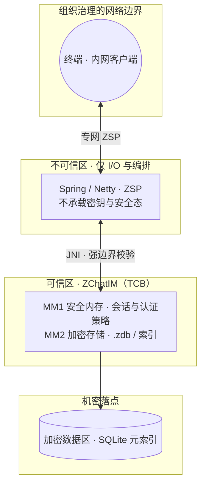

<div align="center">

# ZerOS-Chat · ZChatIM

### 面向 **极限内网安全** 的即时通讯

**在可控专网 / 强隔离内网中，把密码学、密钥与会话、落盘机密收敛到最小可信基（C++ MM1/MM2）；Java 只做 ZSP 与编排，不持有安全态。**

[](docs/01-Architecture/01-Overview.md)
[](https://opensource.org/licenses/MIT)
[](https://cmake.org/)
[](https://en.cppreference.com/w/cpp/17)

*规范与常量以 **`docs/`** 为唯一权威；本页突出**安全立场**与**阅读入口**。*

<br/>



<br/>

[**📖 文档总目录**](docs/README.md) · [**架构总览**](docs/01-Architecture/01-Overview.md) · [**JNI 安全约定**](docs/06-Appendix/01-JNI.md) · [**JNI 实现说明**](ZChatIM/docs/JNI-API-Documentation.md)

</div>

---

## 极限内网安全：设计立场

本项目假设部署在 **由组织统一治理的内网或专网**（边界、准入、审计由基础设施承担），在此前提下把 **IM 自身的机密性 / 完整性 / 可用性对抗面** 压到最低：

| 原则 | 含义 | 深入阅读 |
| :--- | :--- | :--- |
| **可信基极小化** | 敏感逻辑只在 **C++ MM1/MM2**；Spring/Netty 为 **不可信区**，仅编解码 ZSP、路由与调度 JNI。 | [Overview](docs/01-Architecture/01-Overview.md)、[SpringBoot 职责](docs/03-Business/01-SpringBoot.md) |
| **Java 不持密** | 业务侧 **不处理安全相关载荷**，尽量只持 **引用 ID**；密钥、会话策略、限流封禁等在 MM1。 | [01-SpringBoot.md §一](docs/03-Business/01-SpringBoot.md) |
| **JNI 强边界** | 业务 native 首参 **`callerSessionId`**，与头文件及附录 **严格一一对应**，防止「任意会话代调」。 | [01-JNI.md](docs/06-Appendix/01-JNI.md)、[`JniSecurityPolicy.h`](ZChatIM/include/common/JniSecurityPolicy.h) |
| **内存级安全** | MM1 安全内存框架、**多级安全销毁**（异常 / 登出 / 调试检测等路径）。 | [01-MM1.md](docs/02-Core/01-MM1.md) |
| **加密落盘** | `.zdb` 随机噪声填充、随机写入位置 + 加密；SQLite 仅存索引与元数据。 | [03-Storage.md](docs/02-Core/03-Storage.md)、[02-MM2.md](docs/02-Core/02-MM2.md) |
| **认证在可信区** | 认证限流、封禁矩阵、会话表等 **不得在 Java 自实现**，由 MM1 统一裁决（与 IP / 用户维度策略见文档）。 | [02-Auth.md](docs/03-Business/02-Auth.md) |
| **密钥与周期** | Identity / Master / Session / Message 等轮换与职责拆分见业务规范（避免 README 与文档数字漂移）。 | [05-KeyRotate.md](docs/03-Business/05-KeyRotate.md)、[03-Group.md](docs/03-Business/03-Group.md) |
| **通道与身份** | 内网仍可对 TLS / 证书固定等做纵深防御（按功能规范启用与运维）。 | [07-CertPinning.md](docs/04-Features/07-CertPinning.md) |

> **说明**：「极限内网」指在**已约束的网络与终端治理**下，将 **IM 软件栈内的 TCB 与数据面** 做到尽可能小、可审计；**不**等同于「仅靠内网物理隔离即可省略密码学」——规范中的加密、轮换与会话策略仍然成立。

---

## 这个仓库里有什么？

| | |
| :--- | :--- |
| **`docs/`** | 架构、ZSP、MM1/MM2、业务（Auth / Session / 密钥…）、功能、运维与附录。**威胁模型、状态机、阈值与接口表均以文档为准。** |
| **`ZChatIM/`** | 上述规范的 **C++ 可信实现载体**：头文件契约、CMake、已落地管理器、`jni/` 与 native 侧 JNI 文档。 |

Java / Spring Boot 工程**可独立于本仓库**；与 MM1 的调用契约见 **[`docs/03-Business/01-SpringBoot.md`](docs/03-Business/01-SpringBoot.md)**。

**实现索引（C++ ↔ 文档）**：认证限流 / 封禁 → [`02-Auth.md`](docs/03-Business/02-Auth.md) **§七**；IM 会话 idle / `lastActive` → [`04-Session.md`](docs/03-Business/04-Session.md) **§七**。

---

## 文档从哪读？

<div align="center">

| 第一步 | 链接 |
| :--: | :-- |
| **按目录浏览全部规范** | **[`docs/README.md`](docs/README.md)** |
| **系统总览与数据分类** | [`docs/01-Architecture/01-Overview.md`](docs/01-Architecture/01-Overview.md) |
| **ZSP 协议** | [`docs/01-Architecture/02-ZSP-Protocol.md`](docs/01-Architecture/02-ZSP-Protocol.md) |
| **MM1 / MM2 / 存储** | [`docs/02-Core/`](docs/02-Core/) |

</div>

---

## `ZChatIM/` 目录速览

```
ZerOS-Chat/
├── docs/                          ← 规范（权威）
└── ZChatIM/
    ├── CMakeLists.txt             ← ZChatIMCore / 可选 EXE / ZChatIMJNI
    ├── include/                   ← MM1 · MM2 · JNI · 安全策略头文件
    ├── src/mm1/managers/          ← 已接入 CMake 的管理器实现
    ├── jni/                       ← JNI_OnLoad、native 入口
    ├── main.cpp
    ├── tests/                     ← MM1 自检（main --test，无第三方测试库）
    └── docs/JNI-API-Documentation.md
```

---

## 构建 ZChatIM

| 项 | 说明 |
| :--- | :--- |
| 工具链 | **CMake ≥ 3.20**，**C++17** |
| Windows | 自动链接 **bcrypt**（见 `CMakeLists.txt`） |
| JNI | 需要 **JDK** / **`JAVA_HOME`**；无 JDK 时可 `-DZCHATIM_BUILD_JNI=OFF` |
| 自检 | 生成 **`ZChatIM`** 可执行文件后执行 **`ZChatIM --test`**（无第三方测试库）；见 [`ZChatIM/tests/README.md`](ZChatIM/tests/README.md) |

```bash
cd ZChatIM
cmake -B build -DZCHATIM_BUILD_JNI=OFF
cmake --build build --config Release
# 运行 MM1 自检：./build/bin/ZChatIM --test（路径以生成目录为准）
```

更多 CMake 选项见 **`ZChatIM/CMakeLists.txt`**。

---

## 许可证

Copyright © 2026 **AboutUip** · [MIT License](https://opensource.org/licenses/MIT)
