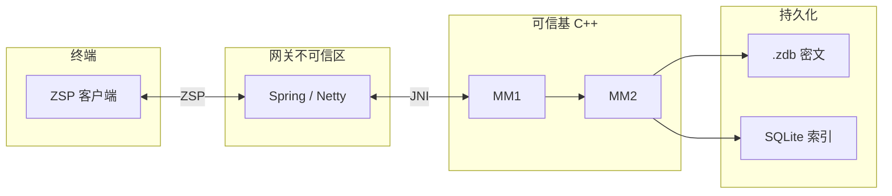

<div align="center">

# ZeroTrust-Chat

> **ZChatIM** — 面向内网 / 强隔离的即时通讯：敏感能力收敛于 **C++ 可信基（MM1 / MM2）**；**`ZChatServer`** 在不可信区完成 **ZSP 入站解码**（`ZspFrameDecoder`）、**出站字节序列化**（`ZspFrameWireEncoder`）与 JNI 编排（见 **`docs/03-Business/01-SpringBoot.md`**）。

[](LICENSE)


<br/>

**产品规范** → **[`docs/README.md`](docs/README.md)**；**持久化裁决** → **[`docs/AUTHORITY.md`](docs/AUTHORITY.md)**；**C++ 构建/实现跟踪** → **[`ZChatIM/docs/README.md`](ZChatIM/docs/README.md)**；**Android 参考客户端（ZChat）** → **[`docs/04-Features/14-Android-Client-ZChat.md`](docs/04-Features/14-Android-Client-ZChat.md)** · **[`Client/Android/README.md`](Client/Android/README.md)**

</div>

---

<p align="center">
  <b>目录</b><br/><br/>
  <a href="#架构一瞥">架构一瞥</a> · <a href="#文档地图">文档地图</a> · <a href="#仓库结构">仓库结构</a><br/>
  <a href="#构建-zchatim">构建 ZChatIM</a> · <a href="#设计原则">设计原则</a> · <a href="#许可证">许可证</a>
</p>

---

<div align="center">

## 架构一瞥

</div>



> [!IMPORTANT]
> 图为**逻辑边界**；进程划分与部署以 **[系统总览](docs/01-Architecture/01-Overview.md)** 为准。

---

## 文档地图

规范索引见 [`docs/README.md`](docs/README.md)。持久化裁决见 [`docs/AUTHORITY.md`](docs/AUTHORITY.md)。C++ 构建、实现状态与范围见 [`ZChatIM/docs/README.md`](ZChatIM/docs/README.md)。

---

## 仓库结构

```text
ZerOS-Chat/
├── CMakeLists.txt     ← 根 CMake 入口（VS 打开仓库根时用）
├── CMakePresets.json  ← 聚合 ZChatIM 预设（需 CMake ≥ 3.24）
├── docs/              ← 产品规范（架构、业务、存储、JNI 契约）
├── ZChatIM/docs/      ← C++ 构建、实现跟踪、Scope
├── ZChatIM/           ← C++：CMake · CMakePresets.json · 源码 · jni/
├── Client/            ← 客户端：发布物约定 → Client/README.md
│   └── Android/       ← ZChat Android 源码与构建 → Client/Android/README.md
├── LICENSE
└── README.md          ← 本页
```

Spring Boot 可与本仓库**解耦**；职责边界见 **[01-SpringBoot.md](docs/03-Business/01-SpringBoot.md)**。

---

## 构建 ZChatIM

完整说明：**[ZChatIM/docs/Build.md](ZChatIM/docs/Build.md)**。

```cmake
# 仅控制台 EXE（不要 JNI DLL）：ZCHATIM_BUILD_MODE=ExeOnly
cd ZChatIM
cmake -B build -DZCHATIM_BUILD_MODE=ExeOnly
cmake --build build --config Release
```

| 环境 | 说明 |
| :---: | :--- |
| **全平台** | **OpenSSL 3.x**（**MM2** AES-GCM / PBKDF2 / RNG、**MM1** Ed25519 **`EVP`**、**SQLCipher**、**`common::Random`** 等）；**Windows** 另 **`crypt32`**（**DPAPI** `mm2_message_key.bin`）；缺失时 CMake **`FATAL_ERROR`** |
| **VS 多配置** | 命令行加 **`--config Release`**（或 IDE 中选 Release） |
| **树内测试** | 默认 **`ZCHATIM_BUILD_TESTS=ON`**，编译 **`ZChatIM/tests/*.cpp`**，**`ZChatIM --test`** 一次跑 common + MM1/MM2 + **minimal MM2** + MM2-50 + JNI IM smoke；最小 exe 时 **`-DZCHATIM_BUILD_TESTS=OFF`** → [Build.md 第7节](ZChatIM/docs/Build.md#7-控制台-exe-与树内测试) |

---

## 设计原则

| 原则 | 含义 |
| :--- | :--- |
| **可信基极小化** | 敏感逻辑在 **MM1 / MM2**；网关按不可信区处理 |
| **Java 不持密** | 业务层不承载安全载荷明文 |
| **JNI 边界** | `callerSessionId` 等与 **[01-JNI.md](docs/06-Appendix/01-JNI.md)**、`JniSecurityPolicy.h` 一致 |
| **持久化从严** | **凡落盘即增加泄露面**；**默认最小化**；仅允许经**白名单 + 生命周期**审定的数据进入 **SQLite / `.zdb`**；**能内存则内存**，**禁止**为省事扩大持久化面 |
| **加密落盘** | 对**获准**落盘的数据：**密文在 `.zdb`**、元数据侧 **SQLCipher（默认）**（[03-Storage.md](docs/02-Core/03-Storage.md)）；**未获准不得落盘** |

冲突与权威链 → [`docs/AUTHORITY.md`](docs/AUTHORITY.md)。

---

<div align="center">

## 许可证

**[MIT License](LICENSE)**

<sub>ZerOS-Chat · 文档以 <code>docs/README.md</code> 为索引</sub>

</div>
