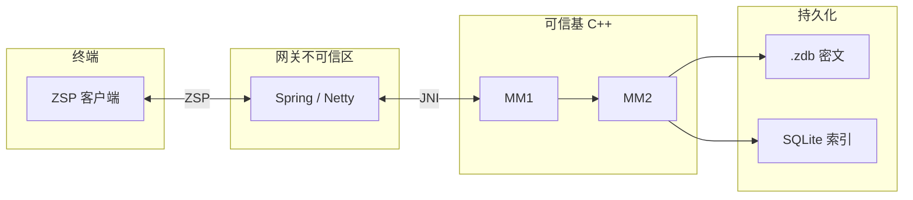

<div align="center">

# ZerOS-Chat

> **ZChatIM** — 面向内网 / 强隔离的即时通讯：敏感能力收敛于 **C++ 可信基（MM1 / MM2）**，Java 只做 **ZSP** 编解码与编排。

[](LICENSE)


<br/>

**全库规范入口** → **[`docs/README.md`](docs/README.md)**（索引、权威链、维护约定）

</div>

---

<p align="center">
  <b>目录</b><br/><br/>
  <a href="#架构一瞥">架构一瞥</a> · <a href="#文档地图">文档地图</a> · <a href="#仓库结构">仓库结构</a><br/>
  <a href="#构建-zchatim">构建 ZChatIM</a> · <a href="#设计原则">设计原则</a> · <a href="#许可证">许可证</a>
</p>

---

<div align="center">

## 架构一瞥

</div>



> [!IMPORTANT]
> 图为**逻辑边界**；进程划分与部署以 **[系统总览](docs/01-Architecture/01-Overview.md)** 为准。

---

## 文档地图

### 架构与协议

| 文档 | 说明 |
| :--- | :--- |
| [01-Overview](docs/01-Architecture/01-Overview.md) | 系统架构总览 |
| [02-ZSP-Protocol](docs/01-Architecture/02-ZSP-Protocol.md) | ZSP 帧与 TLV |

### 核心与存储

| 文档 | 说明 |
| :--- | :--- |
| [01-MM1](docs/02-Core/01-MM1.md) | 安全内存与销毁级别 |
| [02-MM2](docs/02-Core/02-MM2.md) | 消息与存储编排 |
| [03-Storage](docs/02-Core/03-Storage.md) | 表结构、密文落盘、实现对照 |
| [04-ZdbBinaryLayout](docs/02-Core/04-ZdbBinaryLayout.md) | `.zdb` v1 二进制布局 |
| [05-Implementation-Status](docs/02-Core/05-ZChatIM-Implementation-Status.md) | C++ 实现状态（活文档） |

### JNI · 业务 · 构建

| 文档 | 说明 |
| :--- | :--- |
| [01-JNI](docs/06-Appendix/01-JNI.md) | JNI 接口表 |
| [JNI-API-Documentation](ZChatIM/docs/JNI-API-Documentation.md) | JNI 细则与路由 |
| [01-SpringBoot](docs/03-Business/01-SpringBoot.md) | 网关与 MM1 边界 |
| [01-Build-ZChatIM](docs/07-Engineering/01-Build-ZChatIM.md) | CMake、平台、Release |

---

## ◆ 仓库结构

```text
ZerOS-Chat/
├── docs/           ← 全库技术规范（架构 … 工程）
├── ZChatIM/        ← C++：CMake · 源码 · jni/
├── Client/         ← 客户端发布物说明 → Client/README.md
├── LICENSE
└── README.md       ← 本页
```

Spring Boot 可与本仓库**解耦**；职责边界见 **[01-SpringBoot.md](docs/03-Business/01-SpringBoot.md)**。

---

## 构建 ZChatIM

完整说明：**[01-Build-ZChatIM.md](docs/07-Engineering/01-Build-ZChatIM.md)**。

```cmake
# 常用：关闭 JNI，Release 构建
cd ZChatIM
cmake -B build -DZCHATIM_BUILD_JNI=OFF
cmake --build build --config Release
```

| 环境 | 说明 |
| :---: | :--- |
| **Windows** | MM2 使用 **BCrypt**，无需 OpenSSL |
| **Linux / macOS** | 须 **OpenSSL 3.x**；缺失时 CMake 报错并提示修复 |
| **VS 多配置** | 命令行加 **`--config Release`**（或 IDE 中选 Release） |
| **树内测试** | 默认含 `tests/*.cpp`，支持 `--test` / `--test-minimal` / `--test-mm250`；仅编 `main` 时加 **`-DZCHATIM_BUILD_TESTS=OFF`** → [构建说明 第 6.1 节](docs/07-Engineering/01-Build-ZChatIM.md) |

---

## 设计原则

| 原则 | 含义 |
| :--- | :--- |
| **可信基极小化** | 敏感逻辑在 **MM1 / MM2**；网关按不可信区处理 |
| **Java 不持密** | 业务层不承载安全载荷明文 |
| **JNI 边界** | `callerSessionId` 等与 **[01-JNI.md](docs/06-Appendix/01-JNI.md)**、`JniSecurityPolicy.h` 一致 |
| **加密落盘** | 密文在 **`.zdb`**；SQLite 仅索引与元数据（[03-Storage.md](docs/02-Core/03-Storage.md)） |

冲突与权威链 → **[docs/README.md 第 2 节](docs/README.md)**。

---

<div align="center">

## 许可证

**[MIT License](LICENSE)**

<sub>ZerOS-Chat · 文档以 <code>docs/README.md</code> 为索引</sub>

</div>
